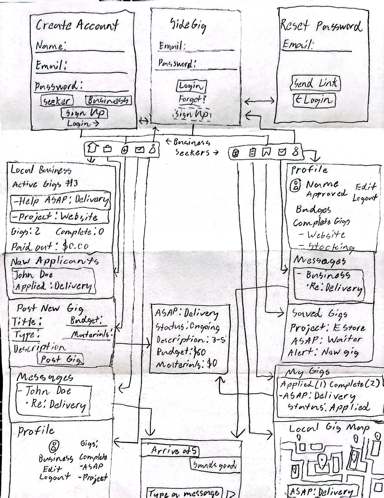

# SideGig

## Table of Contents

1.  [Overview](#Overview)
2.  [Product Spec](#Product-Spec)
3.  [Wireframes](#Wireframes)
4.  [Schema](#Schema)

## Overview

### Description

SideGig is a hyper-local mobile marketplace designed to bridge the gap between small, "off-the-grid" local businesses (like delis, bodegas, and mom-and-pop shops) and local job seekers needing immediate, flexible work. Our core concept is to be "The 'Help Wanted' sign for your neighborhood, right on your phone."

The app is built on a map-based interface showing real-time job opportunities. Trust and safety are paramount, enforced through a robust verification system for both businesses and seekers, a reputation system with badges, and a secure escrow payment model to protect all parties.

### App Evaluation

* **Category:** Marketplace / Utility
* **Mobile:** Yes, mobile-first and location-native. The map-based UI is the core of the user experience and relies on real-time location data.
* **Story:** "The 'Help Wanted' sign for your neighborhood, right on your phone."
* **Market:** A two-sided marketplace:
    * **Businesses:** Small, local "off-the-grid" businesses (delis, bodegas, local shops) that don't use traditional job sites but need immediate or project-based help.
    * **Seekers:** Local job seekers who need immediate, flexible work and a way to build a verifiable reputation.
* **Habit:** For Seekers, it can be a daily-use app when actively looking for work. For Businesses, it's an occasional-use utility, accessed when a staffing or project need arises.
* **Scope:** Narrow in its hyper-local geographic focus, but necessarily broad in its trust, safety, and payment features to ensure a secure and reliable marketplace.

## Product Spec

### 1. User Stories (Required and Optional)

**Required Must-have Stories**

**Seeker (Job Seeker)**

* User (Seeker) can create an account, select the "Seeker" role, and complete identity verification via a secure ID scan.
* User (Seeker) must pass the "SideGig Basics" professionalism quiz to activate their account.
* User (Seeker) can view a map of their immediate area showing available gigs.
* User (Seeker) can visually differentiate between "Immediate Paid Gigs" (Red Pins) and "Project Gigs" (Blue Pins).
* User (Seeker) can tap a gig pin to view detailed information: job description, pay (hourly/flat-rate), Gig Budget, and Materials Budget.
* User (Seeker) can apply for a gig.
* User (Seeker) receives a push notification when a business selects them for a gig.
* User (Seeker) must review and accept a plain-English "Gig Agreement" before a gig can begin.
* User (Seeker) can communicate with the business via real-time, in-app chat.
* User (Seeker) can upload a photo of a receipt to be reimbursed from the "Materials Budget."
* User (Seeker) can mark a gig as "Complete" to notify the business and request payment from escrow.
* User (Seeker) can receive payments directly to their connected bank account.
* User (Seeker) can leave a 1-5 star review for the business after gig completion.
* User (Seeker) can view their profile to see their "Reliability Badge" (after 5 on-time gigs) and any "Skill Badges" awarded by businesses.

**Business (Gig Poster)**

* User (Business) can create an account, select the "Business" role, and complete "Verified Local" verification (by linking a Google/Yelp profile or requesting a mailed verification code).
* User (Business) can post a new gig, specifying the type (Immediate/Project), scope (hourly/flat-rate), Gig Budget, and Materials Budget.
* User (Business) receives push notifications for new applicants.
* User (Business) can review the profiles (badges, ratings) of seekers who have applied.
* User (Business) can select and assign a Seeker to their gig.
* User (Business) must fund the total escrow (Gig Budget + Materials Budget) to initiate the gig.
* User (Business) must review and accept the plain-English "Gig Agreement" to begin the gig.
* User (Business) can communicate with the Seeker via real-time, in-app chat.
* User (Business) receives a notification to approve a Seeker's uploaded materials receipt.
* User (Business) can review and release the escrow payment (Gig + Materials) upon satisfactory gig completion.
* User (Business) can leave a 1-5 star review for the Seeker after gig completion.
* User (Business) can choose to award "Skill Badges" to the Seeker along with their review.
* User (Business) can formally "report" a 1-star review, which contributes to the Seeker's "Three-Strike" count.

**Optional Nice-to-have Stories**

* User (Seeker) can filter the gig map by pay, gig type, or required skills.
* User (Seeker) can add a simple portfolio (e.g., photos of work) to their profile.
* User (Seeker) can save or "watch" gigs for later.
* User (Business) can save gig descriptions as templates for common, recurring needs.
* User (Business) can see an applicant's "Reliability Badge" and "Skill Badges" prominently on their application.
* User (System) can automatically suspend any user (Seeker or Business) who receives three formally reported 1-star reviews.

### 2. Screen Archetypes

* \[X\] **Login / Sign Up Screen**
    * Required User Feature: User can log in with email/password.
    * Required User Feature: User can sign up for a new account (email/password).
    * Required User Feature: User can use "Forgot Password" to retrieve account access.
    * Required User Feature: User can sign up or log in using SSO (Google, Apple, Facebook, LinkedIn).
* \[X\] **Onboarding (Role Select)**
    * Required User Feature: After sign up, user must select their role: "I need work" (Seeker) or "I need help" (Business).
* \[X\] **Seeker Verification Flow**
    * Required User Feature: User (Seeker) can complete the secure ID scan and take the "SideGig Basics" professionalism quiz.
* \[X\] **Business Verification Flow**
    * Required User Feature: User (Business) can link their Google/Yelp profile or request a physical verification code via mail.
* \[X\] **Gig Map (Seeker Home)**
    * Required User Feature: User (Seeker) can see all available Red and Blue gig pins in their local area on a map.
* \[X\] **Gig Details Screen**
    * Required User Feature: User (Seeker) can tap a pin to see gig details, pay, budgets, and business info, and then tap "Apply."
* \[X\] **Post Gig Flow (Business Home)**
    * Required User Feature: User (Business) can create a new gig, defining the title, description, type, pay scope, Gig Budget, and Materials Budget.
* \[X\] **Business Dashboard**
    * Required User Feature: User (Business) can see their posted gigs, review applicants for each, and manage active gigs.
* \[X\] **Fund Escrow Screen**
    * Required User Feature: User (Business) can add a payment method and fund the gig's total escrow.
* \[X\] **Gig Agreement Screen**
    * Required User Feature: Both users must read a plain-English summary of the job and check a box to agree to the terms.
* \[X\] **Active Gig Screen / Chat**
    * Required User Feature: Both users can chat, and the Seeker can access a button to "Upload Material Receipt" and "Mark as Complete."
* \[X\] **Review Screen**
    * Required User Feature: After completion, both users are prompted to leave a 1-5 star review. The business is also given the option to award "Skill Badges."
* \[X\] **Profile Screen (Seeker & Business)**
    * Required User Feature: Users can view their own (or another user's) profile, including average rating, gig history, and earned/awarded badges.

### 3. Navigation

**Tab Navigation (Seeker)**

* \[X\] **Map (Home):** Main gig-finding map interface.
* \[X\] **My Gigs:** List of applied, active, and completed gigs.
* \[X\] **Saved:** A place to "watch" gigs or manage alerts.
* \[X\] **Messages:** In-app chat hub with businesses.
* \[X\] **Profile:** View/edit profile, see badges, manage payment info.

**Tab Navigation (Business)**

* \[X\] **Dashboard (Home):** Manage active gigs, review applicant counts.
* \[X\] **Applicants:** A dedicated list to review all new applicants.
* \[X\] **Post Gig (+ Button):** The large, central button to create a new gig.
* \[X\] **Messages:** In-app chat hub with seekers.
* \[X\] **Profile:** View/edit business profile, see ratings, manage billing.

**Flow Navigation (Screen to Screen)**

* \[X\] **App Launch**
    * Leads to **Login / Sign Up Screen**.
* \[X\] **Login / Sign Up Screen**
    * Successful login leads to **Map (Seeker)** or **Dashboard (Business)**.
    * Successful sign up leads to **Onboarding (Role Select)**.
* \[X\] **Onboarding (Role Select)**
    * Leads to **Seeker Verification Flow** or **Business Verification Flow**.
* \[X\] **Verification Success**
    * Leads to **Map (Seeker)** or **Dashboard (Business)**.
* \[X\] **Map (Seeker)**
    * Tapping a pin leads to **Gig Details**.
* \[X\] **Gig Details (Seeker)**
    * Tapping "Apply" submits the application.
* \[X\] **Dashboard (Business)**
    * Tapping "Post Gig" (+) leads to **Post Gig Flow**.
    * Tapping "Review Applicants" on a gig shows a list of seekers.
    * Tapping "Select Seeker" leads to **Fund Escrow Screen**.
* \[X\] **Fund Escrow Screen (Business)**
    * Successful payment leads to **Gig Agreement Screen** (for both users).
* \[X\] **Gig Agreement Screen**
    * Once both parties accept, leads to **Active Gig Screen / Chat**.
* \[X\] **Active Gig Screen**
    * Seeker tapping "Mark as Complete" notifies Business to approve payment.
* \[X\] **Approve Payment (Business)**
    * Triggers payment release and leads to **Review Screen** for both parties.

## Wireframes

### Wireframe (Low-Fidelity — Hand‑Sketched)

Caption: Low-fidelity hand‑sketch overview showing primary screens and flows and how business and seeker users move between Login, Profile, Gig Details, Post Gig, Active Gig/Chat, and Map.

**BusinessProfile**
| Property | Type | Description |
|---|---|---|
| userId | Pointer (User) | Links to the base User model (primary key). |
| businessName | String | Name of the business. |
| address | String | Physical address. |
| location | GeoPoint | Lat/Lng for map plotting. |
| isVerifiedLocal | Boolean | Status of Google/Yelp/Mail verification. |
| verificationMethod | String | "google", "yelp", or "mail". |
| avgRating | Number | Average of all Review scores (1-5). |

**Gig**
| Property | Type | Description |
|---|---|---|
| gigId | String | Unique ID for the gig (primary key). |
| businessId | Pointer (BusinessProfile) | The business that posted the gig. |
| assignedSeekerId | Pointer (SeekerProfile) | The seeker who accepted the gig (null until assigned). |
| title | String | Short title of the gig. |
| description | String | Full description of the work. |
| gigType | String | "immediate" (Red Pin) or "project" (Blue Pin). |
| payType | String | "hourly" or "flat-rate". |
| gigBudget | Number | Labor cost (in cents). |
| materialsBudget | Number | Max reimbursement for materials (in cents). |
| status | String | "open", "assigned", "active", "pending\_approval", "complete", "cancelled". |
| location | GeoPoint | Lat/Lng for map plotting (copied from BusinessProfile). |
| createdAt | DateTime | Timestamp of gig creation. |
| agreementId | Pointer (Agreement) | Links to the signed agreement. |
| receiptImageUrl | String | URL of the uploaded materials receipt. |
| isEscrowFunded | Boolean | True if business has paid. |

**Agreement**
| Property | Type | Description |
|---|---|---|
| agreementId | String | Unique ID (primary key). |
| gigId | Pointer (Gig) | The related gig. |
| seekerId | Pointer (SeekerProfile) | The assigned seeker. |
| businessId | Pointer (BusinessProfile) | The posting business. |
| agreementText | String | The plain-English summary text shown to both parties. |
| seekerAgreedAt | DateTime | Timestamp of seeker's acceptance. |
| businessAgreedAt | DateTime | Timestamp of business's acceptance. |

**Review**
| Property | Type | Description |
|---|---|---|
| reviewId | String | Unique ID (primary key). |
| gigId | Pointer (Gig) | The related gig. |
| reviewerId | Pointer (User) | The user leaving the review. |
| revieweeId | Pointer (User) | The user being reviewed. |
| rating | Number | 1-5 stars. |
| comment | String | Text comment. |
| awardedBadges | Array (String) | (If reviewer is Business) List of awarded skill badges. |
| isReported | Boolean | True if this is a 1-star "strike" report. |

**Transaction**
| Property | Type | Description |
|---|---|---|
| transactionId | String | Unique ID (primary key). |
| gigId | Pointer (Gig) | The related gig. |
| payerId | Pointer (BusinessProfile) | The business. |
| payeeId | Pointer (SeekerProfile) | The seeker. |
| amount | Number | Total amount transferred (in cents). |
| type | String | "escrow\_funding", "payment\_release", "materials\_reimbursement". |
| status | String | "pending", "complete", "failed". |
| createdAt | DateTime | Timestamp of transaction. |
| appFee | Number | The fee collected by SideGig (in cents). |

### Networking

**Onboarding:**

* `[POST] /auth/signup` - Create base User with email/pass.
* `[POST] /auth/login` - Log in with email/pass.
* `[POST] /auth/forgot-password` - Send password reset link.
* `[POST] /auth/sso/google` - Handle Google SSO callback.
* `[POST] /auth/sso/apple` - Handle Apple SSO callback.
* `[POST] /auth/sso/facebook` - Handle Facebook SSO callback.
* `[POST] /auth/sso/linkedin` - Handle LinkedIn SSO callback.
* `[POST] /seekers/verify-id` - Submit ID scan data.
* `[POST] /seekers/submit-quiz` - Submit quiz results.
* `[POST] /business/verify-link` - Submit Google/Yelp link.

**Seeker (Map):**

* `[GET] /gigs?lat=...&lng=...&radius=...` - Retrieve all open gigs in a map area.
* `[GET] /gigs/{gigId}` - Get details for one gig.
* `[POST] /gigs/{gigId}/apply` - Apply for a gig.
* `[GET] /gigs/saved` - Get all gigs saved by the user.

**Business (Dashboard/Post):**

* `[POST] /gigs` - Create a new gig.
* `[GET] /business/{businessId}/gigs` - Get all gigs for a business (active, past).
* `[GET] /gigs/{gigId}/applicants` - Get all seekers who applied.
* `[GET] /business/applicants/all` - Get all applicants for all active gigs.
* `[POST] /gigs/{gigId}/assign` - Assign a seeker to a gig (sends notification).

**Active Gig:**

* `[POST] /gigs/{gigId}/fund-escrow` - (Business) Trigger payment to fund escrow.
* `[POST] /agreements/{agreementId}/sign` - (Seeker/Business) Sign the agreement.
* `[GET] /chat/{gigId}/messages` - Get chat messages.
* `[POST] /chat/{gigId}/messages` - Send a message (triggers push notification).
* `[POST] /gigs/{gigId}/upload-receipt` - (Seeker) Upload material receipt image.
* `[POST] /gigs/{gigId}/complete` - (Seeker) Mark gig as complete.
* `[POST] /gigs/{gigId}/release-payment` - (Business) Approve receipt and release escrow.

**Reviews:**

* `[POST] /reviews` - Submit a new review, rating, and any badges/reports.